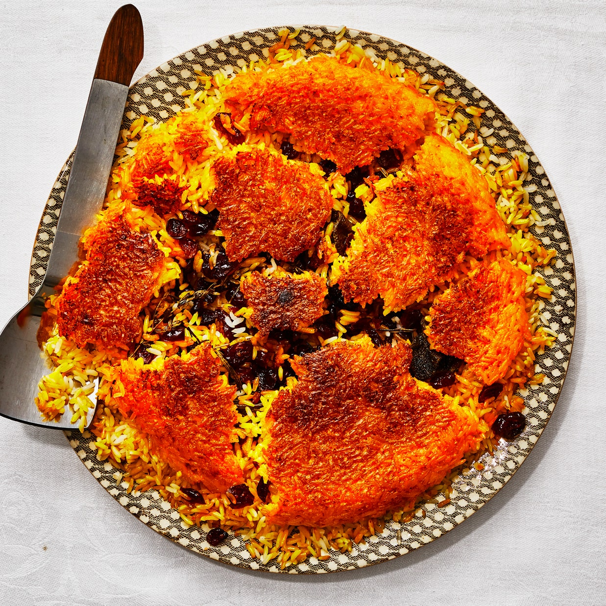

# Und was hast Du im Lockdown gelernt?

Ich mag leider keine Bananen, weswegen ich nicht gelernt habe, Bananenbrot zu backen. Dafür habe ich
- Tahdig zu kochen (und stürzen!) gelernt
- wieder zu häkeln begonnen

Jetzt wird es Zeit, das genderstereotyp zu durchbrechen. Ich lerne R, ich lerne Mathe und ich lerne github zu nutzen. Hello World!

## Wenn du auch etwas neues lernen willst:
... empfehle ich Tahdig sehr. Es ist das perfekte Trostessen und macht unheimlich Eindruck. [Hier findest Du eine einfache Anleitung](https://www.bbcgoodfood.com/howto/guide/veggiestan-how-cook-rice).

